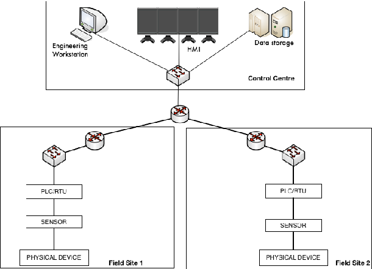

# Network

Download the Docker sources from [https://github.com/marcolucc/PLCs-software](here)

## Send packet 
The `ping` command is a commonly used utility for testing network connectivity by sending ICMP echo request packets to a destination host and waiting for an ICMP echo reply response. Here are the steps to send packets using `ping`:

1.  Open a command prompt or terminal on your computer.
    
2.  Type the following command, replacing the destination IP address with the IP address of the host you want to ping:

    `ping <destination IP address>` 
    
3.  By default, `ping` sends four ICMP echo request packets to the destination host. You can change the number of packets to send using the `-c` flag, for example:
    
    `ping -c 10 <destination IP address>` 
    
4.  You can also change the time interval between packet transmissions using the `-i` flag, for example:
    
    `ping -i 1 <destination IP address>` 
    
    This will send one ICMP echo request packet every second.
    
5.  You can also specify the packet size using the `-s` flag, for example:
    
    `ping -s 1024 <destination IP address>` 
    
    This will send ICMP echo request packets with a size of 1024 bytes.
    
6.  You can use the `-t` flag on Windows or the `-T` flag on Linux to set the Type of Service (TOS) value in the IP header of the ICMP echo request packets, for example:
    
    `ping -t 128 <destination IP address>    # Windows
    ping -T 128 <destination IP address>    # Linux` 
    
7.  You can also use the `-f` flag to set the "do not fragment" (DF) bit in the IP header of the ICMP echo request packets, for example:
    
    `ping -f <destination IP address>` 
    
    This will send ICMP echo request packets with the DF bit set, which will cause the packets to be dropped if they exceed the Maximum Transmission Unit (MTU) of any router along the path to the destination host.
    
8.  Once you send the ICMP echo request packets using `ping`, you can view the ICMP echo reply packets received from the destination host, which will indicate whether the destination host is reachable or not.
    
### ICMP protocol

ICMP stands for Internet Control Message Protocol and is a protocol that is used to send error messages and operational information about network conditions between network devices. It is a layer 3 protocol that is typically carried within IP packets.

ICMP messages are typically generated by routers or hosts and sent to other routers or hosts to communicate network conditions or errors. Some of the common uses of ICMP include:

-   Ping: ICMP echo request and reply messages are used to test connectivity and determine round-trip time between two hosts.
-   Traceroute: ICMP time exceeded messages are used to identify the routers along a path between two hosts.
-   Path MTU discovery: ICMP fragmentation needed messages are used to determine the maximum transmission unit (MTU) of a link between two hosts.
-   ICMP redirect: Routers use ICMP redirect messages to inform hosts of a better next-hop router for a particular destination.

ICMP messages have a type and code field to indicate the type of message and its specific sub-type. The most commonly used ICMP messages are:

-   ICMP echo request and reply: used for ping.
-   ICMP time exceeded: used for traceroute.
-   ICMP destination unreachable: used to indicate that a destination host or network is unreachable.
-   ICMP source quench: used to request that a host reduce its traffic rate.
-   ICMP parameter problem: used to indicate an error in an IP header.

ICMP messages: 

-   0: Echo Reply
-   3: Destination Unreachable
-   4: Source Quench
-   5: Redirect
-   8: Echo Request
-   11: Time Exceeded
-   12: Parameter Problem
-   13: Timestamp
-   14: Timestamp Reply
-   15: Information Request
-   16: Information Reply
-   17: Address Mask Request
-   18: Address Mask Reply

## Capturing packets
Once we have crafted our network packet, we may want to capture and analyze it to further understand how it behaves on the network.

To capture and analyze network traffic, we can use a packet capture tool like Wireshark. Wireshark is a widely used network protocol analyzer that allows us to capture, view, and analyze network traffic in real-time. Here are the steps to capture and analyze network traffic using Wireshark:

1.  Download and install Wireshark from the official website.
    
2.  Open Wireshark and select the network interface that you want to capture traffic on.
    
3.  Click the "Start" button to begin capturing traffic.
    
4.  Send the forged packet that we created earlier to trigger the capture of the network traffic.
    
5.  Stop the capture by clicking the "Stop" button.
    
6.  You should now see the captured packets in the Wireshark GUI. You can analyze the packets by clicking on individual packets to view the packet details, or by using the various analysis tools provided by Wireshark.
    

Some of the useful analysis tools provided by Wireshark include:

-   Protocol hierarchy: This tool displays a breakdown of the protocols used in the captured packets.
    
-   IO graph: This tool displays a graph of the input and output traffic over time.
    
-   Follow TCP stream: This tool displays the full contents of a TCP stream, allowing you to see the complete conversation between two hosts.
    
-   Statistics: This tool provides various statistics and metrics about the captured packets, such as packet count, data volume, and protocol distribution.

## Forging packets (advanced)
In order to forge a network packet, we will need a packet crafting tool.
 
Scapy is a powerful Python-based packet manipulation tool that can be used to forge and manipulate network packets.

Here are the steps to forge a network packet using Scapy:

1.  Open a Python terminal or a Python script.
    
2.  Import Scapy by typing `from scapy.all import *`.
    
3.  To create a new packet, we first need to define the packet headers. For example, to create an IP packet with the source IP address of 192.168.0.1 and the destination IP address of 192.168.0.2, we can use the following code:

`ip_packet = IP(src="192.168.0.1", dst="192.168.0.2")` 

4.  Next, we can define the transport layer protocol to be used, such as TCP or UDP. For example, to create a TCP packet with a source port of 1234 and a destination port of 80, we can use the following code:

`tcp_packet = TCP(sport=1234, dport=80)` 

5.  We can then add the payload or data to the packet. For example, to add the string "Hello World" as the payload, we can use the following code:

`data = "Hello World"` 

6.  Finally, we can combine all the headers and the payload to create the complete packet:

`packet = ip_packet/tcp_packet/data` 

7.  To send the packet, we can use the `send()` function:

`send(packet)` 

This will send the packet to the destination IP address and port specified in the IP and TCP headers respectively.

