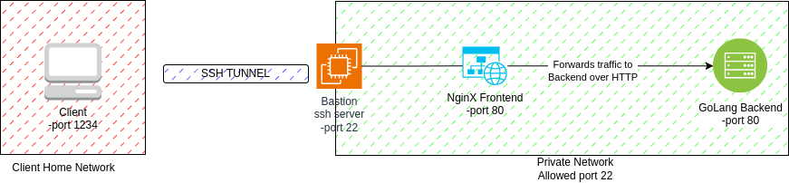
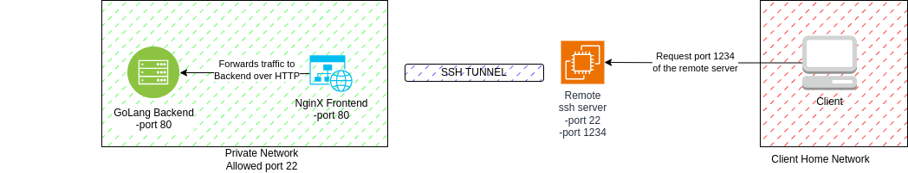

# Local Port Forwarding Laboratory

This laboratory is designed to provide hands-on experience with local port forwarding using Docker and SSH. 

## Prerequisites

- Docker installed on your local machine.
- Basic understanding of Docker and SSH.
- Basic understanding of networking concepts.

## Use case
I need to access a company website using my browser.
The website is hosted on a server in my company network.
My company network policy only allows for SSH connections.
I need to tunnel my HTTP request for the website with SSH.
I also want this process to 

## Diagram



## Steps

1. Clone this repository to your local machine.
2. Navigate to the directory containing the `docker-compose.yml` file.
3. Run `docker-compose up -d` to start the containers in detached mode.
4. Use the following command for local port forwarding with SSH: `ssh -p 2222 user@localhost -L 80:random-service:1234`
    - `-p 2222:22` specifies the host port (2222) to map to the container's SSH port (22).
    - `user@localhost` specifies the user with SSH access on the server container (change user if needed).
    - `-L 80:random-service:1234` sets up local port forwarding:
        - Maps host port 80 to the container named "random-service" on port 9090.
        - This allows you to access your random service running in the container by visiting `http://localhost:80` in your browser.
5. Test your setup by visiting `http://localhost:1234` in your browser.


## Conclusion

By completing this laboratory, you should have a practical understanding of how local port forwarding works. 


# Remote Port Forwarding Laboratory

This laboratory is designed to provide hands-on experience with remote port forwarding, also known as reverse tunneling, using Docker and SSH. 

## Prerequisites

- Docker installed on your local machine.
- Basic understanding of Docker and SSH.
- Basic understanding of networking concepts.

## Diagram



## Steps

1. Clone this repository to your local machine.
2. Navigate to the directory containing the `docker-compose.yml` file.
3. Run `docker-compose up -d` to start the containers in detached mode.
4. Use the following command for remote port forwarding with SSH: `ssh -p 2222 user@localhost -R 1234:localhost:80`
    - `-p 2222:22` specifies the host port (2222) to map to the container's SSH port (22).
    - `user@localhost` specifies the user with SSH access on the server container (change user if needed).
    - `-R 1234:localhost:80` sets up remote port forwarding:
        - Maps host port 8080 to the localhost on port 80.
        - This allows you to access your local web server running on port 80 by visiting `http://localhost:8080` in your browser.
5. Test your setup by visiting `http://localhost:1234` in your browser.


## Conclusion

By completing this laboratory, you should have a practical understanding of how remote port forwarding works. 


# Sniffing HTTP Traffic with Wireshark

In this lab, we will be using Wireshark, a popular network protocol analyzer tool, to sniff and analyze HTTP traffic generated by a Docker Compose setup.

## Docker Compose Setup

Our Docker Compose setup consists of three services:

1. `frontend`: This is a web service that serves as the front-end interface. It depends on the `backend` service.

2. `backend`: This is a service that the `frontend` service depends on.

3. `curler`: This service is used to generate HTTP traffic. It uses the `appropriate/curl` image and continuously sends HTTP requests to the `frontend` service every second.

## Lab Steps

1. Start the Docker Compose setup by running `docker-compose up` in the directory containing the `docker-compose.yml` file.

2. Open Wireshark and start a new live capture.

3. In Wireshark, set the filter to `http` to only show HTTP traffic.

4. Observe the HTTP requests and responses between the `curler` and `frontend` services.

5. Analyze the details of the HTTP packets, such as the headers, payload, and timing information.

6. Stop the Wireshark capture and save the capture file for further analysis.

## Conclusion

By the end of this lab, you should be able to use Wireshark to capture and analyze HTTP traffic in a Docker Compose setup.

# Sniffing HTTPS Traffic with Wireshark

This lab is designed to demonstrate the interception of HTTPS traffic and the principles of Perfect Forward Secrecy (PFS).

## Perfect Forward Secrecy (PFS)

Perfect Forward Secrecy is a feature of specific key agreement protocols that ensures session keys will not be compromised even if the private key of the server is compromised. PFS is achieved by using a unique session key for each session that is not derived from the server's private key. This means that even if an attacker has the server's private key, they cannot decrypt past communications.

## SSL Protocol Steps

The SSL protocol involves several steps:

1. **ClientHello**: The client sends a "ClientHello" message with the SSL/TLS version, supported cipher suites, and a random byte string (Client Random).

2. **ServerHello**: The server responds with a "ServerHello" message, choosing a cipher suite and SSL/TLS version, and providing a random byte string (Server Random).

3. **Certificate**: The server sends its certificate, which includes the server's public key.

4. **Client Key Exchange**: The client generates a random PreMaster Secret, encrypts it with the server's public key, and sends it to the server.

5. **Master Secret Generation**: Both the client and the server use the PreMaster Secret and the Client and Server Randoms to generate the Master Secret.

6. **Session Key Generation**: The Master Secret and the Client and Server Randoms are used to generate the session keys, which are used for encryption and decryption of the data.

7. **Finished**: Both the client and the server send a "Finished" message, encrypted with the session keys, to verify that the key exchange and authentication processes were successful.

## Lab Setup

In this lab, we have a setup with a frontend and a backend service, and a curler service that sends requests to the frontend. The curler service is configured to use specific cipher suites that do not support PFS, allowing us to demonstrate the interception of HTTPS traffic.

To run the lab, use the following command:

```bash
docker-compose up